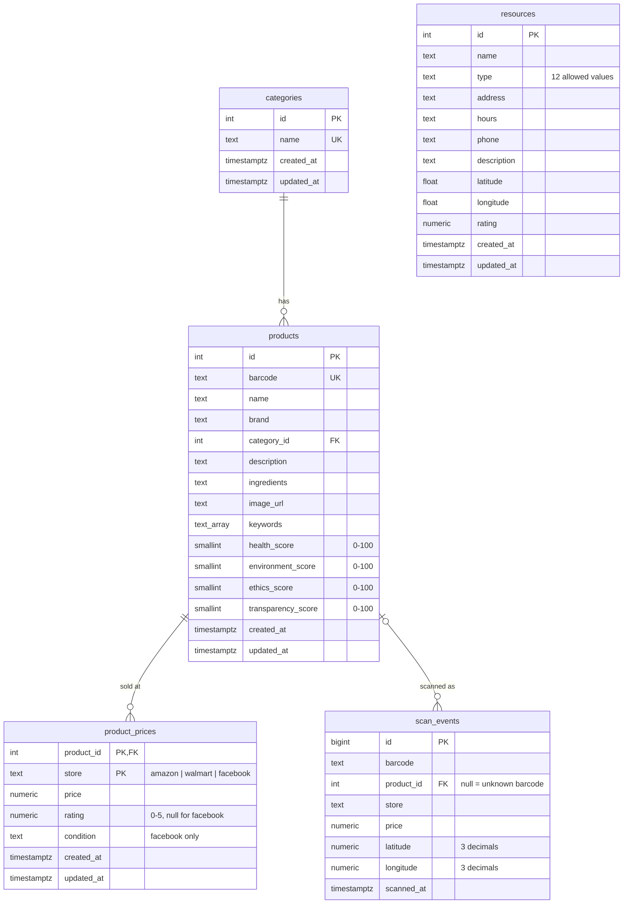

# EcoGo! — Architecture (verified)

> **Verified 2026-09-23.** The original audit read every non-shadcn source file, ran the build and a typecheck, and
> clicked through the app offline. After step 2 (normalized database) the app was re-verified **live** against the
> owner's Supabase project. See [KNOWN_ISSUES.md](KNOWN_ISSUES.md) for bugs and [PROJECT_HANDOFF.md](PROJECT_HANDOFF.md)
> for status and decisions.

## 1. What the app does today

EcoGo! is a **single-screen phone mock-up** (a fixed 390×844 frame centred on a desktop page) built by
Figma Make. After a welcome screen and a 3-slide onboarding it has five tabs:

| Tab | Reality |
|---|---|
| **Home** | Hardcoded "Alex", 15 hardcoded Chicago recommendations with a SmartScore filter, 3 fake deals, a product search box, and the first 5 community resources (from the database). |
| **Map** | A real Leaflet/OpenStreetMap map of **18 Chicago resources** drawn from `MapTab.tsx` `BASE_RESOURCES`. The database overrides only name, hours, phone and description by id, even though the `resources` table now also holds coordinates. |
| **Scan** | **Simulated.** You pick a demo barcode or type one (8–14 digits); there is no camera or decoder yet (M4). The barcode is matched against the catalog, then looked up in **USDA FoodData Central** and then **Open Food Facts** (`lib/lookup.ts`). Scans are **not saved** (M3), and scanning never asks for location. |
| **Saved** | Favorites and Scanned lists, in React state only (lost on reload). "Lists" is static. |
| **Profile** | Entirely static (Alex Johnson, fake stats and badges). The settings rows do nothing. |

The product catalog is **51 products in the Supabase `products` table**, seeded from `src/data/products.csv`. The
CSV is still bundled and shown until the database answers, or instead of it when Supabase is unreachable (offline
fallback). The product detail screen shows an **ingredient safety verdict** computed by the safety engine
(`src/lib/safety`, M1): the ingredient list is parsed and matched whole-word against a 17-entry library in which every
entry cites an official source (IARC, EU, FDA) with a verbatim quote. Flagged ingredients are listed with their sources
and highlighted in the full ingredient text. The page also shows store prices and same-category alternatives with fewer
concerns. There are no AI or "SmartScore™" claims; the old hand-written score text was deleted.

## 2. Stack and tooling

| Item | Value |
|---|---|
| Runtime | Node 24.21.0, npm 11.19.0 (`package-lock.json`) |
| Frontend | React 18.3.1, Vite 6.3.5, Tailwind 4.1.12 via `@tailwindcss/vite`, lucide-react. 7 runtime dependencies (M0 removed 53 unused ones and the shadcn/ui kit) |
| Map | leaflet 1.9.4 + leaflet.markercluster 1.5.3 (used directly, no react-leaflet) |
| Backend | Supabase project **`ecogo`** (`gippyavmxxzqxjkuahpt`, us-west-1, free plan): Postgres + PostgREST + Realtime, reached from the browser with `@supabase/supabase-js` 2.116.0. There is **no edge function.** |
| Config | `.env` (committed): `VITE_SUPABASE_URL`, `VITE_SUPABASE_PUBLISHABLE_KEY` (public by design). `.env.local` (gitignored): `VITE_FDC_API_KEY`, the owner's free data.gov key for USDA FoodData Central (without it the app falls back to `DEMO_KEY`, 30 lookups/hour). Restart the dev server after changing it. |
| Barcode / camera | **None** |
| Types / lint / tests | Tests: Node's built-in `node --test` with native TypeScript type stripping (no test framework). No TypeScript package, tsconfig or ESLint |
| Scripts | `npm run dev` (vite), `npm run build` (vite build), `npm test` (everything under `src/lib/**`: safety engine, 51-product check, lookup client), `npm run verify:sources` (re-fetches every library source and checks its quote; needs internet) |

## 3. System diagram

```
                       Browser (React SPA, one phone-frame page)
 ┌──────────────────────────────────────────────────────────────────────────────┐
 │ main.tsx → App.tsx (state, navigation, Home/Search/Saved/Profile inline)     │
 │   ├─ loadData() ── lib/catalog.ts ──┐        MapTab.tsx ── Leaflet ──► OSM   │
 │   ├─ ScanTab.tsx ─ lib/lookup.ts (USDA → Open Food Facts; saves nothing)      │
 │   └─ ProductDetailScreen.tsx           │   lib/safety/* (ingredient verdict) │
 │ productImporter.ts ◄─ products.csv (bundled) ─► initial / offline catalog    │
 └──────────┬─────────────────────────────┬──┼──────────────────────────────────┘
            │ (1) SELECT products,        │  │ (3) no writes: scans aren't saved (M3)
            │     prices, categories,     │  │
            │     resources               │  │
            │ (2) Realtime: any change on products / product_prices / resources
            │     → App re-runs loadData()│  │
            ▼                             ▼  ▼
 ┌──────────────────────────────────────────────────────────────────────────────┐
 │ Supabase "ecogo"  (publishable key; access = explicit GRANTs + RLS)          │
 │   categories 1─* products 1─* product_prices      resources                  │
 │                     └─* scan_events (no longer written; service role only)   │
 └──────────────────────────────────────────────────────────────────────────────┘
```

## 4. File map and edit policy

| Path | Lines | Role | Policy |
|---|---:|---|---|
| `src/app/App.tsx` | 976 | Shell: all state, navigation, Home/Search/Saved/Profile, catalog load + realtime | SAFE TO EDIT (carefully; see §5) |
| `src/app/components/ProductDetailScreen.tsx` | 266 | Product page: verdict, flagged ingredients with sources, highlighted ingredient list, prices, alternatives | SAFE TO EDIT |
| `src/app/components/verdict.tsx` | 37 | Verdict look (colours, labels, icons), `safeAnalyze` (never throws), headline text; shared by the product page and lists | SAFE TO EDIT |
| `src/lib/safety/*` | 353 + tests | Safety engine: verified library, parser, analyzer; tested by `npm test` | SAFE TO EDIT (library changes must pass `npm run verify:sources` and `npm test`) |
| `src/lib/safety/fixtures/expected-flags.json` | — | Hand-reviewed flags per product id; `catalog.test.ts` checks every product in `products.csv` against it | Review, never loosen |
| `src/app/components/MapTab.tsx` | 593 | Leaflet map, 18 static resources, filters, bottom sheet | SAFE TO EDIT |
| `src/app/components/ScanTab.tsx` | 266 | Simulated scanner: demo barcodes, type-a-barcode, catalog → lookup, not-found and error states | SAFE TO EDIT |
| `src/lib/catalog.ts` | 103 | **Database read layer**: `loadCatalog()` plus the row → `Product` mapper | SAFE TO EDIT |
| `src/lib/productImporter.ts` | 595 | `parseProductsCSV(text)` → `Product[]`, `bestPrice`; defines the canonical `Product` type. App.tsx feeds it the bundled CSV (`?raw`); tests read the file directly | SAFE TO EDIT (keep it import-free so Node tests can load it) |
| `src/lib/lookup.ts` | 133 | USDA FoodData Central + Open Food Facts lookup: pure mappers plus a session-cached `lookupBarcode()`; import-free so Node tests load it | SAFE TO EDIT |
| `src/lib/fixtures/{usda,off}/*.json` | — | Recorded real API responses (trimmed) for `lookup.test.ts` | Re-record, don't hand-edit |
| `src/lib/supabase.ts` | 8 | Browser client from `.env` | SAFE TO EDIT |
| `src/data/products.csv` | 113 | Seed source and offline fallback (112 rows → 51 products) | SAFE TO EDIT (DB won't change; see K-17) |
| `supabase/migrations/*.sql` | — | Schema and seed; file names match the project's migration history | **Add new migrations; never edit applied ones** |
| `.env` | 6 | Public Supabase URL + publishable key | SAFE TO EDIT (no secrets) |
| `vite.config.ts` | 7 | React + Tailwind plugins | EDIT WITH CAUTION |
| `src/styles/*.css` | — | Tailwind entry, theme tokens, Google Fonts | EDIT WITH CAUTION |
| `scripts/verify-sources.mjs` | — | Library source check (`npm run verify:sources`) | SAFE TO EDIT |
| `.github/workflows/deploy.yml` | — | On every push to `main`: `npm ci`, `npm test`, check the `VITE_FDC_API_KEY` secret, build, deploy `dist/` to GitHub Pages | EDIT WITH CAUTION (every push publishes) |
| `src/imports/pasted_text/project-guidelines.md` | 425 | Prompt pasted into Figma Make. Its "capstone/instructor" wording is template text: this is a **personal project**. Use it as engineering-style guidance, not as requirements | Reference only |
| `ATTRIBUTIONS.md`, `postcss.config.mjs` | — | Figma template leftovers | Leave alone |

Removed in step 2: `utils/supabase/info.tsx` (key for the retired Figma project) and `supabase/functions/server/*`
(the key-value edge function). Removed in M0 (`764271c`): the shadcn `ui/` kit (48 files), `figma/`, `guidelines/`,
`pnpm-workspace.yaml`, `default_shadcn_theme.css`, `globals.css`. All remain available in the baseline commit `9ccf3ce`.

## 5. `App.tsx` responsibility map

*Line numbers below predate M0 (1130 lines, now 976): the DEAD sections are gone, `ProductCard` shows the verdict dot,
and search sorts by fewest concerns / price. Order of sections is unchanged.*

```
App.tsx (1130)
├── 1–15      imports (several icons unused)
├── 17–29     types: AppState welcome|onboarding|main · Tab home|map|scan|saved|profile
│             · SubScreen search-results|product-detail|null · ResourceType (6)
├── 31–55     CAT config (6 resource types) · RESOURCES fallback (12, x/y pixel coords)
├── 57–59     PRODUCTS = CSV_PRODUCTS (initial state + offline fallback)
├── 61–64     rowToResource (DB row → Resource)
├── 67–84     ONBOARDING slides · DEALS (fake) · score helpers (bestPrice 9999 sentinel)
├── 86–150    CityMap SVG, ScoreRing, ScoreBar ─────────────── DEAD
├── 152–254   StatusBar (fake 9:41) · WelcomeScreen (Sign In has no onClick) · OnboardingScreen
├── 256–439   RECOMMENDATIONS (15 hardcoded places) · cards · WhyModal · sections
├── 440–467   ProductCard (shows safetyScore %; detail shows overallScore)
├── 468–651   HomeTab: greeting, search, static location pill, deals, nearby resources
├── 652–715   SearchResultsScreen (keywords/name/category; sort health/price/ethics)
├── 716–807   aliases → ProductDetailScreen / ScanTab · inline legacy MapTab ─── DEAD (718–806)
├── 809–870   SavedTab (favorites · scanned · static lists)
├── 871–952   ProfileTab (fully static)
├── 953–985   BottomNav
└── 987–1130  App(): state (savedIds [3,5], scannedIds [2,6] fake seeds) · loadData()
              (loadCatalog → setProducts/setResources → dbStatus live|offline) · realtime
              channel "catalog-realtime" (re-fetch on any change) · openProduct/openSearch/
              toggleSave · render tree
```

Extraction candidates: `hooks/useCatalog` (the `loadData` + realtime effect), `HomeTab`, `SavedTab`, `ProfileTab`,
and the `RECOMMENDATIONS` data. Deleting the dead code at 86–150 and 718–806 is the zero-risk first cut.

## 6. Supabase map

**Project:** `ecogo`, ref `gippyavmxxzqxjkuahpt`, owned by the owner's org. Dashboard:
`https://supabase.com/dashboard/project/gippyavmxxzqxjkuahpt`. The Figma Make project `ipcbqjrceyqleuaufier`
is retired and inaccessible (decision 008).

### Schema (ERD)



**Why these tables:**
- **Categories** are shared by many products (one-to-many).
- **Prices** vary per store, so they live in their own table keyed by (product, store) rather than as columns.
- **The four legacy score columns** (`health_score` … `transparency_score`) stay in the DB and the CSV but nothing reads them since M1; the ingredient verdict is computed at render.
- **An unknown barcode** is simply a scan with `product_id is null`. That's the review queue; no extra flag is needed.
- **Every table** has constraints (`CHECK`, `UNIQUE`, `FK`) and `created_at`/`updated_at` (a trigger maintains `updated_at`).

### Access model (grants decide which tables, RLS decides which rows)

| Table | Browser (`anon` / `authenticated`) | `service_role` / dashboard |
|---|---|---|
| categories, products, product_prices, resources | `SELECT` only (policy "Catalog is publicly readable") | full CRUD |
| scan_events | **nothing**: the insert grant and policy were revoked in M3 (`stop_saving_scans`) | full CRUD |

Verified live on 2026-09-23 with the publishable key. Reading `scan_events`, updating `products` and deleting
`product_prices` all return `42501 permission denied`. The Supabase security advisor reports no issues.

### Realtime

`products`, `product_prices` and `resources` are in the `supabase_realtime` publication. The app opens one channel
(`catalog-realtime`) and re-runs `loadData()` on any INSERT/UPDATE/DELETE, because events can be dropped and a
re-fetch is always correct. `scan_events` is deliberately **not** published, since it holds locations. Verified live:
a price changed in SQL showed up in the open app within about 3 s, without a reload.

### Migrations

`supabase/migrations/20260923221344_catalog_schema.sql` (schema, RLS, grants, realtime) and
`20260923221533_seed_catalog.sql` (13 categories, 51 products, 112 prices, 18 resources, generated from the CSV
importer's output). To recreate the database in another project, apply them in order, for example with the Supabase
CLI (`supabase link` then `supabase db push`) or by pasting them into the SQL editor.

## 7. Data map

| Data | Source of truth | Read path | Write path | Fallback | Realtime | Survives reload? |
|---|---|---|---|---|---|---|
| Products (+ category, prices) | `products`, `product_prices`, `categories` tables | `loadCatalog()` → `rowToProduct` (same shape as the CSV importer; verified identical for all 51) | Dashboard / SQL (service role) | Bundled CSV (initial render, or when Supabase fails or returns no rows) | Any change → re-fetch | yes |
| Resources (Home list) | `resources` table | `loadCatalog()` → `rowToResource`, first 5 by id | Dashboard / SQL | `App.tsx RESOURCES` (12) | Any change → re-fetch | yes |
| Resources (Map) | `MapTab.tsx BASE_RESOURCES` (18, lat/lng) | Overlays name/hours/phone/description from the DB list **by id** | — | static | via App prop | static |
| Scan events | `scan_events` table | nobody (service role only) | **no longer written (M3)**; kept for history, anonymous insert revoked | — | not published | yes (server side) |
| Looked-up products | fetched live per session from USDA FoodData Central (manufacturer label data) or Open Food Facts (crowd-sourced); never stored | `lookupBarcode()` (session cache) | — | error state with Try again | — | no (session list in App state) |
| Scanned ids (Saved › Scanned) | React state, seeded `[2,6]` | — | `onScanResult` | — | — | **no** |
| Favorites | React state, seeded `[3,5]` | — | bookmark toggle | — | — | **no** |
| User location | Browser Geolocation, only when the user taps Map "My Location" | — | never stored | Chicago centre | — | no |
| Scores | Replaced by the ingredient verdict (M1) | — | — | — | — | — |
| Ingredient KB | `src/lib/safety/library.ts` (verified, sourced) | `analyzeIngredients` over `product.ingredients` at render | code + `verify:sources` | "Not enough data" verdict | — | yes |
| Explanations / "AI" text | Replaced by the ingredient verdict (M1) | — | — | — | — | — |
| Partners | none (the Figma seed copy was removed; no screen uses partners) | — | — | — | — | n/a |
| Recommendations, deals, profile | `App.tsx` constants | — | — | — | — | yes (static) |

## 8. Feature inventory

Status legend: **working** means verified in the running app; **partial**; **placeholder** means the UI exists but is
static or a no-op; **broken**.

| Feature | Entry | Status | Notes |
|---|---|---|---|
| Welcome → onboarding → guest | `WelcomeScreen`, `OnboardingScreen` | partial | "Sign In" has no handler; onboarding re-runs on every reload |
| Bottom-tab navigation | `BottomNav` | working | |
| Home recommendations + SmartScore filter + "Why?" modal | `HomeTab` | placeholder | 15 hardcoded Chicago places |
| Home location pill | `HomeTab` | static | "Chicago, IL (demo places)"; no location request since M3 |
| Product search | `HomeTab` → `SearchResultsScreen` | partial | Works; brand not searched; Back loses results |
| Today's Deals | `HomeTab` | placeholder | Cards open unrelated products; "See all" → "No results for deals" |
| Nearby resources | `HomeTab` | partial | From the DB; would crash Home if one of the first 5 had a type outside App's 6 (K-10) |
| Catalog load from Supabase | `App.loadData` → `catalog.ts` | **working** | Verified live; identical to the CSV catalog |
| Live/offline banner | `App` render | working | "Live" only when rows arrive; offline text still says "cached" (it's bundled data) |
| Realtime updates | `App` effect | **working** | Re-fetch on any catalog change; verified live |
| Product detail: safety verdict | `ProductDetailScreen` + `lib/safety` | **working** | Verified live: DiGiorno/Oscar Mayer high (sodium nitrite, found inside the pepperoni), Diet Coke/Doritos some, Horizon/Tropicana none, Tide/Tylenol "food only". `npm test` pins all 51 |
| Flagged ingredients + sources | `ProductDetailScreen` | **working** | Each flag expands to regulator context and source links with a "Source checked" date; flagged phrases highlighted in the ingredient text |
| Verdict in lists + sort | `ProductCard`, `SearchResultsScreen` | **working** | Coloured dot + short label; "Fewest concerns" / "Price" sort |
| Price comparison | `ProductDetailScreen` | partial | DB prices, store rating or FB condition; no links |
| Alternatives with fewer concerns | `ProductDetailScreen` | **working** | Same category, strictly better verdict, tappable (page resets to top); hidden for products without concerns |
| Save / bookmark | `toggleSave` | partial | Works in-session; not persisted |
| Share | `ProductDetailScreen` | placeholder | no-op |
| Map: tiles, clusters, categories, detail sheet, list | `MapTab` | working | Static Chicago data |
| Map: "My Location" + radius | `MapTab` | partial | Empties the map for anyone more than 50 mi from downtown Chicago, with no way back |
| Map: open/closed badge | `MapTab` | partial | Hours parser edge cases; viewer's local timezone |
| Map: Call, directions, search | `MapTab` | placeholder | no-op / absent |
| Map reflects DB resources | `MapTab` | partial | Only 4 text fields by id; DB adds/deletes/coords ignored (K-06) |
| Scan: demo barcode → product | `ScanTab` + `lookup.sameBarcode` | working (simulated) | 14 catalog barcodes (most invented, K-29) plus USDA, Open Food Facts and not-found demos |
| Scan: lookup of non-catalog barcodes | `ScanTab` + `lookup.ts` | **working** | USDA FoodData Central first, then Open Food Facts; session cache; source note on the product page; verified live 2026-09-28 |
| Scan: camera/decoder | — | placeholder | none |
| Scan: record scan event | — | **removed (M3)** | Scans aren't saved (decision 017); no location prompt |
| Scan: barcode not found anywhere | `ScanTab` | working | Honest "We couldn't find this barcode yet" screen |
| Scan history / stats / review queue UI | — | placeholder | Data is in `scan_events`; no screen (dashboard only) |
| Saved › Favorites / Scanned | `SavedTab` | partial | In-memory, fake seeds |
| Saved › Lists | `SavedTab` | placeholder | static |
| Profile, impact stats, badges, settings | `ProfileTab` | placeholder | static; settings rows no-op |
| Partners | — | placeholder | no table, no screen |

## 9. External services

| Service | Used by | Notes |
|---|---|---|
| Supabase (PostgREST, Realtime) | `catalog.ts`, App realtime (read only) | see §6 |
| GitHub Pages + Actions | `.github/workflows/deploy.yml` | Hosts https://skynetrebel42.github.io/ecogo/ |
| USDA FoodData Central (`api.nal.usda.gov/fdc/v1/foods/search`) | `lookup.ts` | Branded foods; key `VITE_FDC_API_KEY` in `.env.local` (3,600 requests/hour); codes tried as typed and 14-digit |
| Open Food Facts (`world.openfoodfacts.org/api/v3`) | `lookup.ts` | No key; crowd-sourced, labelled as such; ODbL credit on product pages; `X-User-Agent: EcoGo/0.1 (personal project)` |
| tile.openstreetmap.org | MapTab | public tiles via the deprecated `{s}` subdomains; attribution hidden by UI |
| images.unsplash.com | Home recommendations | hotlinked photo ids |
| fonts.googleapis.com | `fonts.css` | Plus Jakarta Sans, DM Mono |
| Product/barcode APIs (Open Food Facts etc.) | — | **none**; offline-only |
