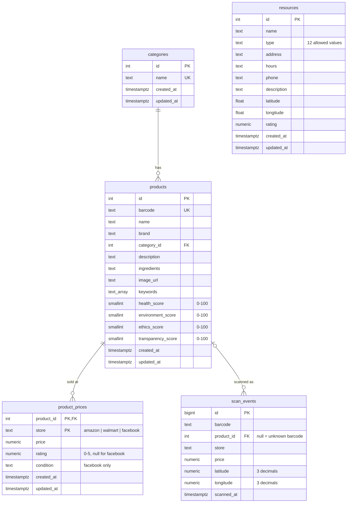

# EcoGo! — Architecture (verified)

> **Verified 2026-09-23.** The original audit read every non-shadcn source file, ran the build and a typecheck, and
> clicked through the app offline. After step 2 (normalized database) the app was re-verified **live** against the
> owner's Supabase project. See [KNOWN_ISSUES.md](KNOWN_ISSUES.md) for bugs and [PROJECT_HANDOFF.md](PROJECT_HANDOFF.md)
> for status and decisions.

## 1. What the app does today

EcoGo! is a **single-screen phone mock-up** (a fixed 390×844 frame centred on a desktop page) built by
Figma Make. After a welcome screen and a 3-slide onboarding it has five tabs:

| Tab | Reality |
|---|---|
| **Home** | Hardcoded "Alex", 15 hardcoded Chicago recommendations with a SmartScore filter, 3 fake deals, a product search box, and the first 5 community resources (from the database). |
| **Map** | A real Leaflet/OpenStreetMap map of **18 Chicago resources** drawn from `MapTab.tsx` `BASE_RESOURCES`. The database overrides only name, hours, phone and description by id, even though the `resources` table now also holds coordinates. |
| **Scan** | **Simulated.** You pick one of 16 demo barcodes and tap Scan. There is no camera and no decoder. The barcode is matched against the loaded catalog, and each scan is **saved to the `scan_events` table** (location rounded to ~100 m). |
| **Saved** | Favorites and Scanned lists, in React state only (lost on reload). "Lists" is static. |
| **Profile** | Entirely static (Alex Johnson, fake stats and badges). The settings rows do nothing. |

The product catalog is **51 products in the Supabase `products` table**, seeded from `src/data/products.csv`. The
CSV is still bundled and shown until the database answers, or instead of it when Supabase is unreachable (offline
fallback). The product detail screen shows a weighted score computed by `scoring.ts` from four hand-entered dimension
scores, an ingredient explorer backed by a 29-entry hand-written knowledge base, store prices and "healthier
alternatives". **Nothing is AI:** the "AI Evaluation Summary" and "SmartScore™" text is hardcoded for product ids
1–7, and every other product gets a template.

## 2. Stack and tooling

| Item | Value |
|---|---|
| Runtime | Node 24.21.0, npm 11.19.0 (`package-lock.json`; `pnpm-workspace.yaml` is a Figma leftover) |
| Frontend | React 18.3.1, Vite 6.3.5, Tailwind 4.1.12 via `@tailwindcss/vite`, shadcn/ui (48 files, unused), lucide-react |
| Map | leaflet 1.9.4 + leaflet.markercluster 1.5.3 (used directly, no react-leaflet) |
| Backend | Supabase project **`ecogo`** (`gippyavmxxzqxjkuahpt`, us-west-1, free plan): Postgres + PostgREST + Realtime, reached from the browser with `@supabase/supabase-js` 2.116.0. There is **no edge function.** |
| Config | `.env` (committed): `VITE_SUPABASE_URL`, `VITE_SUPABASE_PUBLISHABLE_KEY` (public by design). Put secrets in `.env.local` (gitignored). |
| Barcode / camera | **None** |
| Types / lint / tests | **None**: no TypeScript package, no tsconfig, no ESLint, no test runner |
| Scripts | `npm run dev` (vite), `npm run build` (vite build) |

## 3. System diagram

```
                       Browser (React SPA, one phone-frame page)
 ┌──────────────────────────────────────────────────────────────────────────────┐
 │ main.tsx → App.tsx (state, navigation, Home/Search/Saved/Profile inline)     │
 │   ├─ loadData() ── lib/catalog.ts ──┐        MapTab.tsx ── Leaflet ──► OSM   │
 │   ├─ ScanTab.tsx ─ lib/scanService.ts ─┐                                     │
 │   └─ ProductDetailScreen.tsx           │   lib/scoring.ts (overall + grade)  │
 │ productImporter.ts ◄─ products.csv (bundled) ─► initial / offline catalog    │
 └──────────┬─────────────────────────────┬──┼──────────────────────────────────┘
            │ (1) SELECT products,        │  │ (3) INSERT scan_events
            │     prices, categories,     │  │     (6 columns, no read-back)
            │     resources               │  │
            │ (2) Realtime: any change on products / product_prices / resources
            │     → App re-runs loadData()│  │
            ▼                             ▼  ▼
 ┌──────────────────────────────────────────────────────────────────────────────┐
 │ Supabase "ecogo"  (publishable key; access = explicit GRANTs + RLS)          │
 │   categories 1─* products 1─* product_prices      resources                  │
 │                     └─* scan_events (insert-only, private)                   │
 └──────────────────────────────────────────────────────────────────────────────┘
```

## 4. File map and edit policy

| Path | Lines | Role | Policy |
|---|---:|---|---|
| `src/app/App.tsx` | 1130 | Shell: all state, navigation, Home/Search/Saved/Profile, catalog load + realtime, about 150 lines of dead code | SAFE TO EDIT (carefully; see §5) |
| `src/app/components/ProductDetailScreen.tsx` | 886 | Product detail, 29-entry ingredient KB, hardcoded explanations for ids 1–7 | SAFE TO EDIT |
| `src/app/components/MapTab.tsx` | 593 | Leaflet map, 18 static resources, filters, bottom sheet | SAFE TO EDIT |
| `src/app/components/ScanTab.tsx` | 392 | Simulated scanner UI, 16 demo barcodes | SAFE TO EDIT |
| `src/lib/catalog.ts` | 103 | **Database read layer**: `loadCatalog()` plus the row → `Product` mapper | SAFE TO EDIT |
| `src/lib/productImporter.ts` | 692 | CSV → `Product[]` at module load; defines the canonical `Product` type | SAFE TO EDIT |
| `src/lib/scanService.ts` | 150 | Geolocation, barcode lookup, `scan_events` insert | SAFE TO EDIT |
| `src/lib/scoring.ts` | 148 | Weights 30/25/25/20, grade-from-ethics | SAFE TO EDIT |
| `src/lib/supabase.ts` | 8 | Browser client from `.env` | SAFE TO EDIT |
| `src/data/products.csv` | 113 | Seed source and offline fallback (112 rows → 51 products) | SAFE TO EDIT (DB won't change; see K-17) |
| `supabase/migrations/*.sql` | — | Schema and seed; file names match the project's migration history | **Add new migrations; never edit applied ones** |
| `.env` | 6 | Public Supabase URL + publishable key | SAFE TO EDIT (no secrets) |
| `src/app/components/ui/*` (48 files) | 5110 | shadcn/ui boilerplate, imported by nothing | GENERATED BUT EDITABLE WITH CAUTION |
| `src/app/components/figma/ImageWithFallback.tsx` | 27 | Figma helper (unused) | GENERATED, EDIT WITH CAUTION |
| `vite.config.ts` | 38 | Figma asset resolver, `@` alias | EDIT WITH CAUTION |
| `src/styles/*.css`, `default_shadcn_theme.css` | — | Tailwind entry, theme tokens, Google Fonts | EDIT WITH CAUTION |
| `src/imports/pasted_text/project-guidelines.md` | 425 | The owner's own Figma Make prompt (capstone goals) | Reference only |
| `guidelines/Guidelines.md`, `ATTRIBUTIONS.md`, `pnpm-workspace.yaml`, `postcss.config.mjs` | — | Figma template leftovers | Leave alone |

Removed in step 2: `utils/supabase/info.tsx` (key for the retired Figma project) and `supabase/functions/server/*`
(the key-value edge function). Both remain available in the baseline commit `63eef63`.

## 5. `App.tsx` responsibility map

```
App.tsx (1130)
├── 1–15      imports (several icons unused)
├── 17–29     types: AppState welcome|onboarding|main · Tab home|map|scan|saved|profile
│             · SubScreen search-results|product-detail|null · ResourceType (6)
├── 31–55     CAT config (6 resource types) · RESOURCES fallback (12, x/y pixel coords)
├── 57–59     PRODUCTS = CSV_PRODUCTS (initial state + offline fallback)
├── 61–64     rowToResource (DB row → Resource)
├── 67–84     ONBOARDING slides · DEALS (fake) · score helpers (bestPrice 9999 sentinel)
├── 86–150    CityMap SVG, ScoreRing, ScoreBar ─────────────── DEAD
├── 152–254   StatusBar (fake 9:41) · WelcomeScreen (Sign In has no onClick) · OnboardingScreen
├── 256–439   RECOMMENDATIONS (15 hardcoded places) · cards · WhyModal · sections
├── 440–467   ProductCard (shows safetyScore %; detail shows overallScore)
├── 468–651   HomeTab: greeting, search, geolocation pill (coords unused), deals, nearby resources
├── 652–715   SearchResultsScreen (keywords/name/category; sort health/price/ethics)
├── 716–807   aliases → ProductDetailScreen / ScanTab · inline legacy MapTab ─── DEAD (718–806)
├── 809–870   SavedTab (favorites · scanned · static lists)
├── 871–952   ProfileTab (fully static)
├── 953–985   BottomNav
└── 987–1130  App(): state (savedIds [3,5], scannedIds [2,6] fake seeds) · loadData()
              (loadCatalog → setProducts/setResources → dbStatus live|offline) · realtime
              channel "catalog-realtime" (re-fetch on any change) · openProduct/openSearch/
              toggleSave · render tree
```

Extraction candidates: `hooks/useCatalog` (the `loadData` + realtime effect), `HomeTab`, `SavedTab`, `ProfileTab`,
and the `RECOMMENDATIONS` data. Deleting the dead code at 86–150 and 718–806 is the zero-risk first cut.

## 6. Supabase map

**Project:** `ecogo`, ref `gippyavmxxzqxjkuahpt`, owned by the owner's org. Dashboard:
`https://supabase.com/dashboard/project/gippyavmxxzqxjkuahpt`. The Figma Make project `ipcbqjrceyqleuaufier`
is retired and inaccessible (decision 008).

### Schema (ERD)



**Why these tables:**
- **Categories** are shared by many products (one-to-many).
- **Prices** vary per store, so they live in their own table keyed by (product, store) rather than as columns.
- **Overall score and letter grade are not stored.** `scoring.ts` derives them, as the capstone brief asks, so they can't drift.
- **An unknown barcode** is simply a scan with `product_id is null`. That's the review queue; no extra flag is needed.
- **Every table** has constraints (`CHECK`, `UNIQUE`, `FK`) and `created_at`/`updated_at` (a trigger maintains `updated_at`).

### Access model (grants decide which tables, RLS decides which rows)

| Table | Browser (`anon` / `authenticated`) | `service_role` / dashboard |
|---|---|---|
| categories, products, product_prices, resources | `SELECT` only (policy "Catalog is publicly readable") | full CRUD |
| scan_events | `INSERT` of `barcode, product_id, store, price, latitude, longitude` only; **no SELECT** (policy "Anyone can record a scan") | full CRUD |

Verified live on 2026-09-23 with the publishable key. Reading `scan_events`, updating `products` and deleting
`product_prices` all return `42501 permission denied`. The Supabase security advisor reports no issues.

### Realtime

`products`, `product_prices` and `resources` are in the `supabase_realtime` publication. The app opens one channel
(`catalog-realtime`) and re-runs `loadData()` on any INSERT/UPDATE/DELETE, because events can be dropped and a
re-fetch is always correct. `scan_events` is deliberately **not** published, since it holds locations. Verified live:
a price changed in SQL showed up in the open app within about 3 s, without a reload.

### Migrations

`supabase/migrations/20260923221344_catalog_schema.sql` (schema, RLS, grants, realtime) and
`20260923221533_seed_catalog.sql` (13 categories, 51 products, 112 prices, 18 resources, generated from the CSV
importer's output). To recreate the database in another project, apply them in order, for example with the Supabase
CLI (`supabase link` then `supabase db push`) or by pasting them into the SQL editor.

## 7. Data map

| Data | Source of truth | Read path | Write path | Fallback | Realtime | Survives reload? |
|---|---|---|---|---|---|---|
| Products (+ category, prices) | `products`, `product_prices`, `categories` tables | `loadCatalog()` → `rowToProduct` (same shape as the CSV importer; verified identical for all 51) | Dashboard / SQL (service role) | Bundled CSV (initial render, or when Supabase fails or returns no rows) | Any change → re-fetch | yes |
| Resources (Home list) | `resources` table | `loadCatalog()` → `rowToResource`, first 5 by id | Dashboard / SQL | `App.tsx RESOURCES` (12) | Any change → re-fetch | yes |
| Resources (Map) | `MapTab.tsx BASE_RESOURCES` (18, lat/lng) | Overlays name/hours/phone/description from the DB list **by id** | — | static | via App prop | static |
| Scan events | `scan_events` table | nobody (clients can't read; dashboard only) | ScanTab → `scanService` INSERT | none (failure logged, UI continues) | not published | yes (server side) |
| Scanned ids (Saved › Scanned) | React state, seeded `[2,6]` | — | `onScanResult` | — | — | **no** |
| Favorites | React state, seeded `[3,5]` | — | bookmark toggle | — | — | **no** |
| User location | Browser Geolocation (Home pill, Map "My Location", Scan) | — | stored only with scans, rounded to 3 decimals | "Chicago, IL (default)" / Chicago centre | — | no |
| Scores | four dimension columns → `scoring.ts` weighted sum; grade = ethics only | — | — | — | — | yes |
| Ingredient KB | `ProductDetailScreen.tsx` (29 entries) | parsed from `product.ingredients` at render | — | "No detailed data" | — | yes |
| Explanations / "AI" text | `ProductDetailScreen.tsx` (ids 1–7), template otherwise | — | — | template | — | yes |
| Partners | none (the Figma seed copy was removed; no screen uses partners) | — | — | — | — | n/a |
| Recommendations, deals, profile | `App.tsx` constants | — | — | — | — | yes (static) |

## 8. Feature inventory

Status legend: **working** means verified in the running app; **partial**; **placeholder** means the UI exists but is
static or a no-op; **broken**.

| Feature | Entry | Status | Notes |
|---|---|---|---|
| Welcome → onboarding → guest | `WelcomeScreen`, `OnboardingScreen` | partial | "Sign In" has no handler; onboarding re-runs on every reload |
| Bottom-tab navigation | `BottomNav` | working | |
| Home recommendations + SmartScore filter + "Why?" modal | `HomeTab` | placeholder | 15 hardcoded Chicago places |
| Home location pill | `HomeTab` | placeholder | Label only; coords unused; Refresh can stick on "Locating…" |
| Product search | `HomeTab` → `SearchResultsScreen` | partial | Works; brand not searched; Back loses results |
| Today's Deals | `HomeTab` | placeholder | Cards open unrelated products; "See all" → "No results for deals" |
| Nearby resources | `HomeTab` | partial | From the DB; would crash Home if one of the first 5 had a type outside App's 6 (K-10) |
| Catalog load from Supabase | `App.loadData` → `catalog.ts` | **working** | Verified live; identical to the CSV catalog |
| Live/offline banner | `App` render | working | "Live" only when rows arrive; offline text still says "cached" (it's bundled data) |
| Realtime updates | `App` effect | **working** | Re-fetch on any catalog change; verified live |
| Product detail: score ring + breakdown | `ProductDetailScreen` | partial | List shows `safetyScore`, detail shows `overallScore` (e.g. Tide 38% vs 35/100) |
| Grade badge | `ProductDetailScreen` | partial | Grade comes from ethics only; 15/51 products contradict their overall score |
| "AI Evaluation Summary", "Why this score?" | `ProductDetailScreen` | placeholder | Hardcoded text, ids 1–7 only |
| Ingredient explorer + deep dive | `ProductDetailScreen` | partial | Many false HIGH-risk matches (K-02/K-03) |
| Price comparison | `ProductDetailScreen` | partial | DB prices; distance and availability hardcoded; no links |
| Healthier alternatives | `ProductDetailScreen` | partial | Ignores category (chips → laundry detergent); rows not clickable |
| Save / bookmark | `toggleSave` | partial | Works in-session; not persisted |
| Share | `ProductDetailScreen` | placeholder | no-op |
| Map: tiles, clusters, categories, detail sheet, list | `MapTab` | working | Static Chicago data |
| Map: "My Location" + radius | `MapTab` | partial | Empties the map for anyone more than 50 mi from downtown Chicago, with no way back |
| Map: open/closed badge | `MapTab` | partial | Hours parser edge cases; viewer's local timezone |
| Map: Call, directions, search | `MapTab` | placeholder | no-op / absent |
| Map reflects DB resources | `MapTab` | partial | Only 4 text fields by id; DB adds/deletes/coords ignored (K-06) |
| Scan: demo barcode → product | `ScanTab` + `scanService` | working (simulated) | 14 real UPCs plus 2 unknown |
| Scan: camera/decoder | — | placeholder | none |
| Scan: record scan event | `scanService.recordProductScan` | **working** | Verified: row saved in `scan_events` |
| Scan: unknown barcode "saved for review" | `ScanTab` + `createPlaceholder` | partial | Saves with `product_id` null; the screen still says "saved" even if the insert fails |
| Scan history / stats / review queue UI | — | placeholder | Data is in `scan_events`; no screen (dashboard only) |
| Saved › Favorites / Scanned | `SavedTab` | partial | In-memory, fake seeds |
| Saved › Lists | `SavedTab` | placeholder | static |
| Profile, impact stats, badges, settings | `ProfileTab` | placeholder | static; settings rows no-op |
| Partners | — | placeholder | no table, no screen |

## 9. External services

| Service | Used by | Notes |
|---|---|---|
| Supabase (PostgREST, Realtime) | `catalog.ts`, `scanService.ts`, App realtime | see §6 |
| tile.openstreetmap.org | MapTab | public tiles via the deprecated `{s}` subdomains; attribution hidden by UI |
| images.unsplash.com | Home recommendations | hotlinked photo ids |
| fonts.googleapis.com | `fonts.css` | Plus Jakarta Sans, DM Mono |
| Product/barcode APIs (Open Food Facts etc.) | — | **none**; offline-only |
