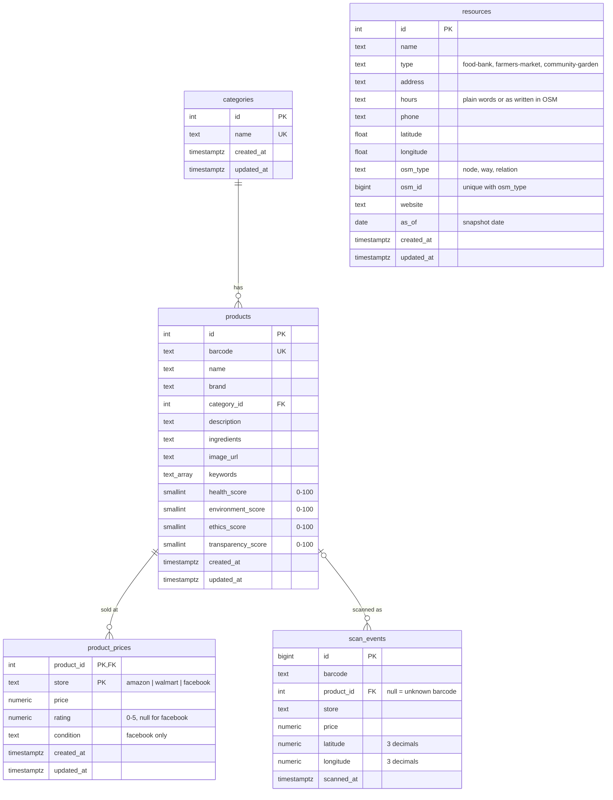

# EcoGo! — Architecture (verified)

> **Verified 2026-09-23.** The original audit read every non-shadcn source file, ran the build and a typecheck, and
> clicked through the app offline. After step 2 (normalized database) the app was re-verified **live** against the
> owner's Supabase project. See [KNOWN_ISSUES.md](KNOWN_ISSUES.md) for bugs and [PROJECT_HANDOFF.md](PROJECT_HANDOFF.md)
> for status and decisions.

## 1. What the app does today

EcoGo! is a **single-screen phone mock-up** (a fixed 390×844 frame centred on a desktop page) built by
Figma Make. After a one-time welcome screen (first visit on this device) it has five tabs (Home, Map, Scan, Saved, Profile;
the Map came back with real places in M9):

| Tab | Reality |
|---|---|
| **Home** | Real content only (M7): a time-based greeting, a Scan card, product search, "Recently scanned" (last 10 products opened, on this device, `lib/recent.ts`) and "Hidden risks, explained" cards that open sourced explainer pages (`Explainer.tsx`). |
| **Map** | Real LA County food places (162) from an OpenStreetMap snapshot (OSM data as of 2026-06-01) in `resources`; credited, dated, no ratings or open/closed (M9). Food banks, farmers markets, named community gardens; filter chips; My location (asked only on tap, never stored or sent) sorts nearest first; cards with hours in plain words, Call / Website / Directions (Google Maps, the place's position only) and "Fix it on OSM". No connection → "Places need a connection", never fake places. |
| **Scan** | **Camera.** The Scan tab opens the back camera and reads EAN/UPC barcodes on the device (`CameraScanner`, `lib/barcodeReader.ts`: native BarcodeDetector or bundled ZXing WebAssembly; a code counts after two identical reads). Typing a barcode or a demo barcode does the same. The barcode is matched against the catalog, then looked up in **USDA FoodData Central** and then **Open Food Facts** (`lib/lookup.ts`). Frames never leave the device; scans are **not saved** (M3), and scanning never asks for location. |
| **Saved** | Favorites (React state only, start empty, lost on reload, K-16; a looked-up product shows here however it was opened) and Scanned (the same recent list as Home, kept on this device). The static "Lists" tab is gone (M7.4). |
| **Profile** | Only true things (M7.2): your data on this device (Recently scanned count with Clear; a favorites note), where results come from, what leaves the phone (privacy), and the source-code link. No account, name or stats. |

The product catalog is **51 products in the Supabase `products` table**, seeded from `src/data/products.csv`. The
CSV is still bundled and shown until the database answers, or instead of it when Supabase is unreachable (offline
fallback). The product detail screen shows an **ingredient safety verdict** computed by the safety engine
(`src/lib/safety`, M1): the ingredient list is parsed and matched whole-word against a 17-entry library in which every
entry cites an official source (IARC, EU, FDA) with a verbatim quote. Flagged ingredients are listed with their sources
and highlighted in the full ingredient text. The page also shows same-category alternatives with fewer concerns. No
prices are shown anywhere (they were invented, K-30; the data stays in the database, M7.4). There are no AI or
"SmartScore™" claims; the old hand-written score text was deleted.

## 2. Stack and tooling

| Item | Value |
|---|---|
| Runtime | Node 24.21.0, npm 11.19.0 (`package-lock.json`) |
| Frontend | React 18.3.1, Vite 6.3.5, Tailwind 4.1.12 via `@tailwindcss/vite`, lucide-react. 8 runtime dependencies (M0 removed 53 unused ones and the shadcn/ui kit; tw-animate-css went in the 2026-10-02 cleanup) |
| Map | leaflet 1.9.4 + leaflet.markercluster 1.5.3 (used directly, no react-leaflet). Back in the bundle with the Map (M9) |
| Backend | Supabase project **`ecogo`** (`gippyavmxxzqxjkuahpt`, us-west-1, free plan): Postgres + PostgREST + Realtime, reached from the browser with `@supabase/supabase-js` 2.116.0. One Edge Function since M7.5: **`usda-relay`** (`supabase/functions/usda-relay/index.ts`, `verify_jwt` off) relays the app's two USDA searches and holds the USDA key as the Supabase secret `FDC_API_KEY`. |
| Config | `.env` (committed): `VITE_SUPABASE_URL`, `VITE_SUPABASE_PUBLISHABLE_KEY` (public by design). No key is needed to run or build the app (M7.5): the USDA key is a Supabase secret the owner sets in the dashboard, and `.env.local` no longer needs `VITE_FDC_API_KEY`. |
| Barcode / camera | **None** |
| Types / lint / tests | Tests: Node's built-in `node --test` with native TypeScript type stripping (no test framework). No TypeScript package, tsconfig or ESLint |
| Scripts | `npm run dev` (vite), `npm run build` (vite build), `npm test` (everything under `src/lib/**`: safety engine, 51-product check, lookup client), `npm run verify:sources` (re-fetches every library source and checks its quote; needs internet) |

## 3. System diagram

```
                       Browser (React SPA, one phone-frame page)
 ┌──────────────────────────────────────────────────────────────────────────────┐
 │ main.tsx → App.tsx (state, navigation, Home/Search/Saved/Profile inline)     │
 │   ├─ loadData() ── lib/catalog.ts ──┐        (MapTab.tsx: hidden, M7.4)      │
 │   ├─ ScanTab.tsx ─ lib/lookup.ts (USDA via usda-relay → Open Food Facts)      │
 │   └─ ProductDetailScreen.tsx           │   lib/safety/* (concern level)      │
 │ productImporter.ts ◄─ products.csv (bundled) ─► initial / offline catalog    │
 └──────────┬─────────────────────────────┬──┼──────────────────────────────────┘
            │ (1) SELECT products,        │  │ (3) no writes: scans aren't saved (M3)
            │     categories,             │  │
            │     resources               │  │
            │ (2) Realtime: any change on products / resources
            │     → App re-runs loadData()│  │
            ▼                             ▼  ▼
 ┌──────────────────────────────────────────────────────────────────────────────┐
 │ Supabase "ecogo"  (publishable key; access = explicit GRANTs + RLS)          │
 │   categories 1─* products 1─* product_prices      resources                  │
 │                     └─* scan_events (no longer written; service role only)   │
 └──────────────────────────────────────────────────────────────────────────────┘
```

## 4. File map and edit policy

| Path | Lines | Role | Policy |
|---|---:|---|---|
| `src/app/App.tsx` | 599 | Shell: all state, navigation, Home/Search/Saved/Profile, catalog load + realtime | SAFE TO EDIT (carefully; see §5) |
| `src/app/components/ProductDetailScreen.tsx` | 280 | Product page: concern badge, findings grouped by origin (ingredients / the food itself / formed when cooked) with sources, nutrition, highlighted ingredient list, alternatives (no prices since M7.4) | SAFE TO EDIT |
| `src/app/components/verdict.tsx` | 66 | Concern-level look (one darkening hue, filled-circle icons, no green), `safeAnalyze` (never throws), headline text, 🔥 marker, category icons; shared by the product page and lists | SAFE TO EDIT |
| `src/lib/safety/*` | 568 + tests | Safety engine: verified library, parser, analyzer; tested by `npm test` | SAFE TO EDIT (library changes must pass `npm run verify:sources` and `npm test`) |
| `src/lib/safety/foodConcerns.ts` | 164 | Food-level concerns with sources: processed meat (IARC Group 1, raises the level) and the acrylamide marker (EU 2017/2158 food types, never sets a level) | SAFE TO EDIT (source changes must pass `npm run verify:sources`) |
| `src/lib/safety/assess.ts` | 24 | Concern level = strongest of the additive check and food-level concerns; non-food stays non-food | SAFE TO EDIT |
| `src/lib/safety/fixtures/expected-flags.json` | — | Hand-reviewed flags per product id; `catalog.test.ts` checks every product in `products.csv` against it | Review, never loosen |
| `src/app/components/MapTab.tsx` | 265 | The Map (M9): Leaflet + clusters of the `resources` rows only, three type chips, My location, list sheet, place card, © OSM credit | SAFE TO EDIT |
| `src/lib/osmPlaces.ts` | 172 | Pure: OSM element → `resources` row (`toPlace`), hours in plain words (`formatHours`, unknown patterns kept as written), address, LA box, sorting, OSM / edit / directions links; tested by `osmPlaces.test.ts` | SAFE TO EDIT |
| `scripts/fetch-osm-places.mjs` | 62 | Hand-run snapshot: Overpass query (LA County boundary) or a saved response → migration SQL replacing every `resources` row | SAFE TO EDIT (the output is a new migration; never edit an applied one) |
| `src/app/components/ScanTab.tsx` | 266 | Simulated scanner: demo barcodes, type-a-barcode, catalog → lookup, not-found and error states | SAFE TO EDIT |
| `src/lib/catalog.ts` | 103 | **Database read layer**: `loadCatalog()` plus the row → `Product` mapper | SAFE TO EDIT |
| `src/lib/productImporter.ts` | 76 | `parseProductsCSV(text)` → `Product[]` (first row per id; no price fields since the 2026-10-02 cleanup) and `splitCSVLine`; defines the canonical `Product` and `ProductSource` types. App.tsx feeds it the bundled CSV (`?raw`); tests and `scripts/apply-verified-barcodes.mjs` read the file directly | SAFE TO EDIT (keep it import-free so Node tests can load it) |
| `src/lib/lookup.ts` | 187 | USDA FoodData Central (through `relayUrl`, M7.5) + Open Food Facts lookup: pure mappers plus a session-cached `lookupBarcode()` that attaches nutrition; `knownNutrition()` reads nutrition already fetched this session (no request) | SAFE TO EDIT |
| `supabase/functions/usda-relay/index.ts` | 43 | The USDA relay (M7.5): pure `handle(req, { key }, fetch)` + `Deno.serve`; GET/OPTIONS only, allowed origins, `query` + `pageSize` 5\|15 only, fixed upstream URL, never returns the key; tested by `index.test.ts` | EDIT WITH CAUTION (security surface; redeploy with `verify_jwt` off) |
| `src/lib/scanner.ts` | 38 | Pure scan logic: grocery formats, `normalizeScanned` (digits; UPC-E → UPC-A), `confirmReads` (two identical reads in a row) | SAFE TO EDIT |
| `src/lib/recent.ts` | 49 | "Recently scanned": `addRecent` (newest first, no duplicates, 10 max), `resolveRecent` (catalog ids re-read, looked-up snapshots kept), `parseRecent`, and `loadRecent`/`saveRecent` around `localStorage["ecogo.recent.v1"]` that never throw | SAFE TO EDIT |
| `src/app/components/Explainer.tsx` | — | Home's "Hidden risks, explained" pages (5: "Nothing flagged" isn't "healthy", badge levels, seed oils, pesticides, ultra-processed foods): `EXPLAINERS`, `ExplainerId`, plain text over official sources only (each with its verbatim quote and "Source checked" date; the M7.1 sources are `Cite` constants in the file) | SAFE TO EDIT (text must match its sources word for word) |
| `src/lib/barcodeReader.ts` | 25 | `createDetector()`: the native BarcodeDetector when it reads all four grocery formats, else the `barcode-detector` ponyfill with ZXing's `.wasm` bundled by Vite (no CDN) | SAFE TO EDIT |
| `src/app/components/CameraScanner.tsx` | 151 | Live back-camera screen: detect loop, torch, denied/unsupported/paused states, drawer for typing; stops the camera on ✕, unmount and page hide | SAFE TO EDIT |
| `src/lib/nutrition.ts` | 99 | Added sugar, saturated fat and sodium per serving as FDA %DV with FDA's 5/20 rule, from USDA search records and OFF `nutriments`; pure | SAFE TO EDIT |
| `src/app/components/NutritionPanel.tsx` | 85 | Nutrition section, `useNutrition` (catalog foods look up nutrition once per session by their verified barcode) and the slate "High …" chip | SAFE TO EDIT |
| `src/data/verified-barcodes.json` | — | Source of truth for catalog food barcodes: each USDA record's barcode, fdcId, name and full label (owner-approved 2026-10-01), plus the removed ones | Review; change only with a USDA match, then rerun the applier and add a migration |
| `scripts/apply-verified-barcodes.mjs` | 58 | Applies `verified-barcodes.json` to `products.csv` and prints the matching SQL migration | SAFE TO EDIT |
| `src/lib/fixtures/{usda,off}/*.json` | — | Recorded real API responses (trimmed) for `lookup.test.ts` | Re-record, don't hand-edit |
| `src/lib/supabase.ts` | 8 | Browser client from `.env` | SAFE TO EDIT |
| `src/data/products.csv` | 113 | Seed source and offline fallback (112 rows → 51 products) | SAFE TO EDIT (DB won't change; see K-17) |
| `supabase/migrations/*.sql` | — | Schema and seed; file names match the project's migration history | **Add new migrations; never edit applied ones** |
| `.env` | 6 | Public Supabase URL + publishable key | SAFE TO EDIT (no secrets) |
| `vite.config.ts` | 7 | React + Tailwind plugins | EDIT WITH CAUTION |
| `src/styles/*.css` | — | Tailwind entry, theme tokens, Google Fonts | EDIT WITH CAUTION |
| `scripts/verify-sources.mjs` | — | Library source check (`npm run verify:sources`) | SAFE TO EDIT |
| `.github/workflows/deploy.yml` | — | On every push to `main`: `npm ci`, `npm test`, build, deploy `dist/` to GitHub Pages (no USDA key since M7.5) | EDIT WITH CAUTION (every push publishes) |
| `ATTRIBUTIONS.md` | — | Figma template leftover | Leave alone |

Removed in step 2: `utils/supabase/info.tsx` (key for the retired Figma project) and `supabase/functions/server/*`
(the key-value edge function). Removed in M0 (`764271c`): the shadcn `ui/` kit (48 files), `figma/`, `guidelines/`,
`pnpm-workspace.yaml`, `default_shadcn_theme.css`, `globals.css`. All remain available in the baseline commit `9ccf3ce`.
Removed 2026-10-02 (cleanup): `src/imports/pasted_text/project-guidelines.md` (the Figma Make prompt, unreferenced;
its "capstone" wording was template text), the empty `postcss.config.mjs`, and `src/styles/fonts.css` +
`tailwind.css` (merged into `index.css`).

## 5. `App.tsx` responsibility map

*Line numbers below predate M0 (1130 lines, now 976): the DEAD sections are gone, `ProductCard` shows the verdict dot,
and search sorts by fewest concerns (the price sort went in M7.4). Order of sections is unchanged; M7.4 removed the
Map tab, the resource data and Saved › Lists.*

```
App.tsx (1130)
├── 1–15      imports (several icons unused)
├── 17–29     types: AppState welcome|onboarding|main · Tab home|map|scan|saved|profile
│             · SubScreen search-results|product-detail|null · ResourceType (6)
├── 31–55     CAT config (6 resource types) · RESOURCES fallback (12, x/y pixel coords)
├── 57–59     PRODUCTS = CSV_PRODUCTS (initial state + offline fallback)
├── 61–64     rowToResource (DB row → Resource)
├── 67–84     ONBOARDING slides · DEALS (fake) · score helpers (bestPrice 9999 sentinel)
├── 86–150    CityMap SVG, ScoreRing, ScoreBar ─────────────── DEAD
├── 152–254   StatusBar (fake 9:41) · WelcomeScreen (Sign In has no onClick) · OnboardingScreen
├── 256–439   RECOMMENDATIONS (15 hardcoded places) · cards · WhyModal · sections
├── 440–467   ProductCard (shows safetyScore %; detail shows overallScore)
├── 468–651   HomeTab: greeting, search, static location pill, deals, nearby resources
├── 652–715   SearchResultsScreen (keywords/name/category; sort health/price/ethics)
├── 716–807   aliases → ProductDetailScreen / ScanTab · inline legacy MapTab ─── DEAD (718–806)
├── 809–870   SavedTab (favorites · scanned · static lists)
├── 871–952   ProfileTab (fully static)
├── 953–985   BottomNav
└── 987–1130  App(): state (savedIds [3,5], scannedIds [2,6] fake seeds) · loadData()
              (loadCatalog → setProducts/setResources → dbStatus live|offline) · realtime
              channel "catalog-realtime" (re-fetch on any change) · openProduct/openSearch/
              toggleSave · render tree
```

Extraction candidates: `hooks/useCatalog` (the `loadData` + realtime effect), `HomeTab`, `SavedTab`, `ProfileTab`,
and the `RECOMMENDATIONS` data. Deleting the dead code at 86–150 and 718–806 is the zero-risk first cut.

## 6. Supabase map

**Project:** `ecogo`, ref `gippyavmxxzqxjkuahpt`, owned by the owner's org. Dashboard:
`https://supabase.com/dashboard/project/gippyavmxxzqxjkuahpt`. The Figma Make project `ipcbqjrceyqleuaufier`
is retired and inaccessible (decision 008).

### Schema (ERD)



**Why these tables:**
- **Categories** are shared by many products (one-to-many).
- **Prices** vary per store, so they live in their own table keyed by (product, store) rather than as columns.
- **The four legacy score columns** (`health_score` … `transparency_score`) stay in the DB and the CSV but nothing reads them since M1; the ingredient verdict is computed at render.
- **An unknown barcode** is simply a scan with `product_id is null`. That's the review queue; no extra flag is needed.
- **Every table** has constraints (`CHECK`, `UNIQUE`, `FK`) and `created_at`/`updated_at` (a trigger maintains `updated_at`).

### Access model (grants decide which tables, RLS decides which rows)

| Table | Browser (`anon` / `authenticated`) | `service_role` / dashboard |
|---|---|---|
| categories, products, product_prices, resources | `SELECT` only (policy "Catalog is publicly readable") | full CRUD |
| scan_events | **nothing**: the insert grant and policy were revoked in M3 (`stop_saving_scans`) | full CRUD |

Verified live on 2026-09-23 with the publishable key. Reading `scan_events`, updating `products` and deleting
`product_prices` all return `42501 permission denied`. The Supabase security advisor reports no issues.

### Realtime

`products`, `product_prices` and `resources` are in the `supabase_realtime` publication. The app opens one channel
(`catalog-realtime`) and re-runs `loadData()` on any INSERT/UPDATE/DELETE of `products` or `resources` (since the
2026-10-02 cleanup it no longer listens to `product_prices`, which nothing reads), because events can be dropped and a
re-fetch is always correct. `scan_events` is deliberately **not** published, since it holds locations. Verified live:
a price changed in SQL showed up in the open app within about 3 s, without a reload.

### Migrations

`supabase/migrations/20260923221344_catalog_schema.sql` (schema, RLS, grants, realtime) and
`20260923221533_seed_catalog.sql` (13 categories, 51 products, 112 prices, 18 resources, generated from the CSV
importer's output). To recreate the database in another project, apply them in order, for example with the Supabase
CLI (`supabase link` then `supabase db push`) or by pasting them into the SQL editor.

## 7. Data map

| Data | Source of truth | Read path | Write path | Fallback | Realtime | Survives reload? |
|---|---|---|---|---|---|---|
| Products (+ category) | `products`, `categories` tables (`product_prices` holds the invented prices, K-30: no longer read) | `loadCatalog()` → `rowToProduct` (same shape as the CSV importer; verified identical for all 51) | Dashboard / SQL (service role) | Bundled CSV (initial render, or when Supabase fails or returns no rows) | Any change → re-fetch | yes |
| Map places (M9) | `resources` table: an OpenStreetMap snapshot (162 rows, OSM data as of 2026-06-01) | `loadCatalog()` → `places` state → `MapTab` | migrations generated by `scripts/fetch-osm-places.mjs` | **none** (no connection → "Places need a connection") | Any change → re-fetch | yes |
| Scan events | `scan_events` table | nobody (service role only) | **no longer written (M3)**; kept for history, anonymous insert revoked | — | not published | yes (server side) |
| Looked-up products | fetched live per session from USDA FoodData Central (manufacturer label data) or Open Food Facts (crowd-sourced); never stored | `lookupBarcode()` (session cache) | — | error state with Try again | — | no (session list in App state) |
| Recently scanned (Home, Saved › Scanned) | `localStorage["ecogo.recent.v1"]` on this device | — | `openProduct` (every product opened) | — | — | **yes** (this browser only) |
| Favorites | React state, starts empty (M7.4; was a fake `[3,5]` seed) | — | bookmark toggle | — | — | **no** |
| User location | Browser Geolocation, only when the user taps My location on the Map | — | never stored or sent | LA centre | — | no |
| Scores | Replaced by the ingredient verdict (M1) | — | — | — | — | — |
| Ingredient KB | `src/lib/safety/library.ts` (verified, sourced) | `assessProduct` (additives + food-level concerns) over the product at render | code + `verify:sources` | "Not enough data" verdict | — | yes |
| Explanations / "AI" text | Replaced by the ingredient verdict (M1) | — | — | — | — | — |
| Partners | none (the Figma seed copy was removed; no screen uses partners) | — | — | — | — | n/a |
| Recommendations, deals, profile | `App.tsx` constants | — | — | — | — | yes (static) |

## 8. Feature inventory

Status legend: **working** means verified in the running app; **partial**; **placeholder** means the UI exists but is
static or a no-op; **broken**.

| Feature | Entry | Status | Notes |
|---|---|---|---|
| Welcome (first visit) | `WelcomeScreen` | **working** | One screen (M7.3): "Know what's in your food", Start scanning (opens Scan) / Look around first (Home); shown once per device via `localStorage["ecogo.welcomed.v1"]` (blocked storage just shows it again) |
| Bottom-tab navigation | `BottomNav` | working | Home, Scan (raised green circle), Saved, Profile; Map hidden (M7.4) |
| Home: greeting, Scan card, search, recently scanned | `HomeTab`, `lib/recent.ts` | **working** | Real content only (M7); recently scanned kept on this device, newest first, with Clear |
| Home: hidden-risk explainers | `Explainer.tsx` | **working** | 5 pages: "Nothing flagged" isn't "healthy" (FDA 5/20 rule); what the badge levels mean (WHO/IARC, acrylamide); seed oils (AHA, EFSA, EU); pesticides (FDA, IARC, EPA, EFSA; links to badge levels); ultra-processed foods (FDA, HHS). Verbatim sources with dates; none changes the badge |
| Product search | `HomeTab` → `SearchResultsScreen` | partial | Works; brand not searched; Back loses results |
| Today's Deals, Nearby resources | — | **removed (M7)** | Invented content; Home shows only real things. The resource data and `rowToResource` went in M7.4 (K-10 moot) |
| Catalog load from Supabase | `App.loadData` → `catalog.ts` | **working** | Verified live; identical to the CSV catalog |
| Live/offline banner | `App` render | working | "Live" only when rows arrive; offline: "Offline — showing the built-in catalog" (M7.4, K-11) |
| Realtime updates | `App` effect | **working** | Re-fetch on any catalog change; verified live |
| Concern badge (4 levels) | `verdict.tsx` + `lib/safety/assess.ts` | **working** | Nothing flagged (grey ○) → Some concern ◔ → High concern ◑ → Known carcinogen ●, one darkening hue, no green; readable in greyscale. Verified 2026-09-30: Diet Coke/Doritos some, Lay's nothing flagged, Tide "food only". `npm test` pins all 51 |
| Processed meat | `lib/safety/foodConcerns.ts` | **working** | IARC Group 1: products that are processed meat read "Known carcinogen" (Oscar Mayer, SPAM, Jimmy Dean); products that only contain it read "High concern" (DiGiorno: "Contains processed meat: Pepperoni"; also bacon baked beans, sausage bowls), while a USDA processed-meat category or a use word ("Sandwich Style", "Pizza Topping") keeps deli meat Known; a name match needs meat in the ingredients, so hot dog buns and plant-based "sausage" don't match; meat-free versions and look-alike words excluded |
| Acrylamide marker | `lib/safety/foodConcerns.ts` | **working** | 🔥 "forms when cooked" on EU 2017/2158 food types (Lay's, Oreo, Nature Valley, Pringles, Special K, Wonder, Goldfish), with IARC/EFSA/EU/FDA sources; never changes the level |
| Nutrition (FDA %DV) | `NutritionPanel` + `lib/nutrition.ts` | **working** | Added sugar, sat fat, sodium per serving, High ≥ 20% / Low ≤ 5% (FDA), amounts in FDA label increments so they match the printed label, "not listed" when missing; catalog foods by verified barcode, looked-up products from USDA/OFF; one "High …" chip on cards once known this session (lists never fetch). Verified 2026-10-01: Oreo 28% added sugar High, DiGiorno sat fat 25% + sodium 33% High, Coke Zero Low ×3 |
| Flagged ingredients + sources | `ProductDetailScreen` | **working** | Each flag expands to regulator context and source links with a "Source checked" date; flagged phrases highlighted in the ingredient text |
| Verdict in lists + sort | `ProductCard`, `SearchResultsScreen` | **working** | Category icon, level icon + short label, 🔥 line when acrylamide matches; one order, "Sorted by fewest concerns" (the price sort went in M7.4) |
| Price comparison, store chips, "best price" | — | **removed (M7.4)** | The prices were invented (K-30); `product_prices` and the CSV keep them for a real source later |
| Alternatives with fewer concerns | `ProductDetailScreen` | **working** | Same category, strictly better verdict, then fewer flags, then name; tappable (page resets to top); hidden for products without concerns |
| Save / bookmark | `toggleSave` | partial | Works in-session for catalog and looked-up products; starts empty; not persisted |
| Share | — | **removed (M7.4)** | Did nothing (K-21); returns with links |
| Map | `MapTab` + `lib/osmPlaces.ts` | **working** (M9) | 162 real LA County food places from OSM, labelled community-edited and dated; verified by `check-map.mjs` (19 checks) |
| Scan: demo barcode → product | `ScanTab` + `lookup.sameBarcode` | working | In the camera's drawer: 10 USDA-verified catalog codes plus USDA, Open Food Facts and not-found demos |
| Scan: lookup of non-catalog barcodes | `ScanTab` + `lookup.ts` | **working** | USDA FoodData Central first, then Open Food Facts; session cache; source note on the product page; verified live 2026-09-28 |
| Scan: camera/decoder | `CameraScanner` + `lib/barcodeReader.ts` + `lib/scanner.ts` | **working** | On-device EAN/UPC reading (native or ZXing WebAssembly); two identical reads; UPC-E expanded; camera stops on ✕/leave/hide. Verified 2026-10-01 with a fake camera (Oreo in ~1 s); the owner's phone check is pending |
| Scan: record scan event | — | **removed (M3)** | Scans aren't saved (decision 017); no location prompt |
| Scan: barcode not found anywhere | `ScanTab` | working | Honest "We couldn't find this barcode yet" screen |
| Scan history / stats / review queue UI | — | placeholder | Data is in `scan_events`; no screen (dashboard only) |
| Saved › Favorites / Scanned | `SavedTab` | partial | Favorites in memory, start empty (K-16); Scanned = the recent list on this device |
| Saved › Lists | — | **removed (M7.4)** | Three hardcoded lists and a dead New button |
| Profile | `ProfileTab` | **working** | Your data (recent count + Clear), where results come from, privacy, source-code link; no invented content (M7.2) |
| Partners | — | placeholder | no table, no screen |

## 9. External services

| Service | Used by | Notes |
|---|---|---|
| Supabase (PostgREST, Realtime) | `catalog.ts`, App realtime (read only) | see §6 |
| GitHub Pages + Actions | `.github/workflows/deploy.yml` | Hosts https://skynetrebel42.github.io/ecogo/ |
| USDA FoodData Central (`api.nal.usda.gov/fdc/v1/foods/search`) | `usda-relay` Edge Function, called by `lookup.ts` | Branded foods; the key is the Supabase secret `FDC_API_KEY` (M7.5); all visitors share USDA's limit for the relay (plan for 1,000 requests an hour in total); codes tried as typed and 14-digit |
| Open Food Facts (`world.openfoodfacts.org/api/v3`) | `lookup.ts` | No key; crowd-sourced, labelled as such; ODbL credit on product pages; `X-User-Agent: EcoGo/0.1 (personal project)` |
| tile.openstreetmap.org | MapTab | public tiles, `https://tile.openstreetmap.org/{z}/{x}/{y}.png` (no `{s}` subdomains); © OpenStreetMap contributors credit always visible (M9) |
| Overpass API | `scripts/fetch-osm-places.mjs` | snapshot time only (by hand); the app never calls it |
| Google Maps | MapTab "Directions" link | opens `google.com/maps/dir/?api=1&destination=<lat>,<lng>`: the place's position only |
| images.unsplash.com | Home recommendations | hotlinked photo ids |
| fonts.googleapis.com | `src/styles/index.css` | Plus Jakarta Sans (DM Mono dropped 2026-10-02: it was never wired to `font-mono`) |
| Product/barcode APIs (Open Food Facts etc.) | — | **none**; offline-only |
